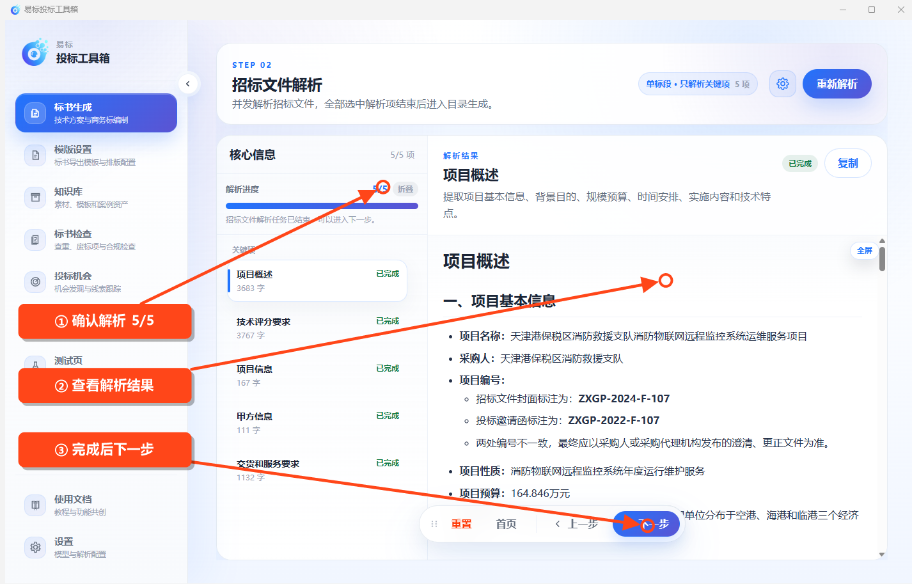
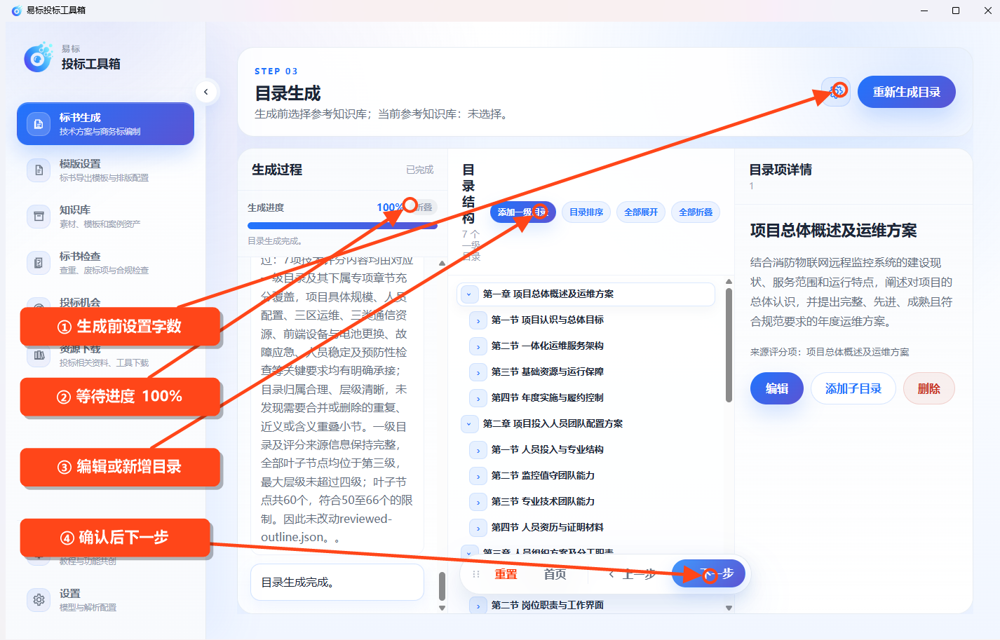
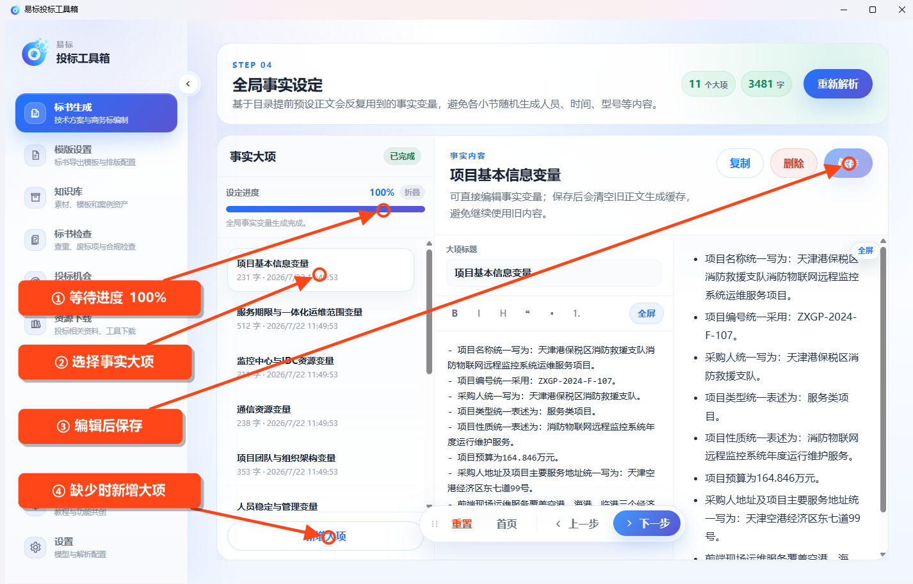
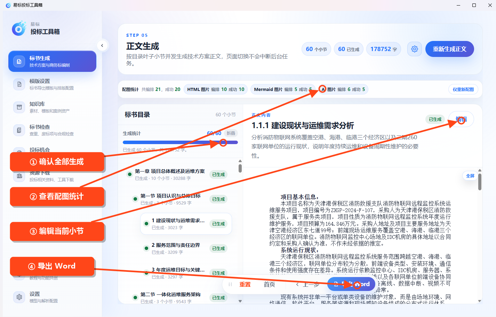

# 生成技术方案

在左侧点击 **标书生成 → 生成技术方案**。

## 第一步：选择招标文件

点击 **选择** 或 **替换** 导入招标文件。确认上方显示文件信息、中间可以预览正文后，点击底部 **下一步**。

## 第二步：解析招标文件

进入“招标文件解析”后点击 **开始解析**；如果任务已经自动开始，只需等待。软件支持单标段和多标段解析，可在右上角设置中调整。

项目概述、技术评分要求、项目信息、甲方信息、交货和服务要求全部显示“已完成”，解析进度达到 5/5 后，点击 **下一步**。

## 第三步：生成和检查目录

生成目录前，可点击右上角设置按钮：

- 选择要参考的文档知识库。
- 设置正文最少字数、最多字数和每小节字数。
- 需要更严格控制时，开启“强控小节字数”，生成时会尽量控制在目标值上下 20% 内。
- 页面会根据字数显示预估页数，实际页数还会受到模板、图片和表格影响。

设置完成后点击 **生成目录**。如果已经生成过目录，修改字数设置后需要重新生成目录才会生效。

等待进度达到 100%，再检查目录：

- 编辑标题，添加一级目录或子目录。
- 删除多余目录，使用 **目录排序** 调整顺序。
- 点击目录项查看生成依据和说明。

确认无误后点击 **下一步**。

## 第四步：检查全局事实

点击 **开始解析**，软件会整理项目名称、编号、工期、地点、人员等会在正文中反复使用的信息。

等待进度达到 100%，逐项检查内容。发现错误时直接编辑并保存；缺少内容时点击 **新增大项**。编辑事实会清理旧正文生成缓存，后续正文将使用新内容。

## 第五步：生成正文并导出

点击 **生成正文**。任务会在后台按目录叶子小节并发生成，切换页面不会中断。

页面会显示小节总数、已完成数量、总字数和配图统计。等待所有小节显示“已生成”后：

1. 点击左侧小节查看正文。
2. 点击右上角 **编辑** 修改当前小节。
3. 点击底部 **导出 Word**，选择保存位置并等待导出进度完成。

导出后打开 Word，检查目录、分页、字数、图片和表格。
