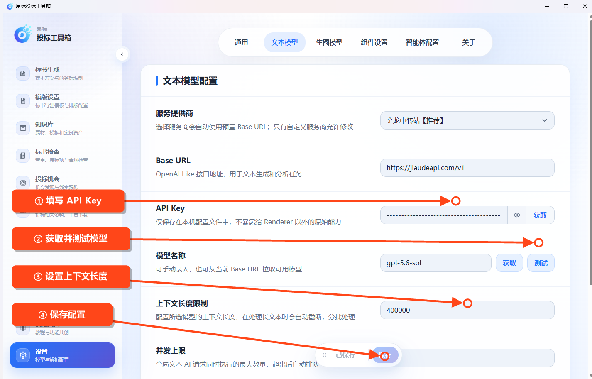

# 配置文本模型（必做）

第一次使用时，点击左下角 **设置**。顶部可以切换通用、文本模型、生图模型、组件设置和智能体配置。

进入 **设置 → 文本模型**，按下面顺序操作：

1. 选择服务提供商。预置服务会自动填写 Base URL；使用自定义服务时再修改。
2. 填写 API Key。
3. 点击模型名称右侧的 **获取** 并选择模型，也可以直接填写模型名称。
4. 按模型能力填写上下文长度限制。处理长文件时，软件会据此自动分批。
5. 设置并发上限。数值越大速度可能越快，但会增加服务商限流风险，新手可先保持默认值。
6. 按服务商要求选择请求类型。
7. 点击 **测试**，成功后点击底部 **保存**。

如果测试失败，重点检查 API Key、模型名称、Base URL 和网络连接。
