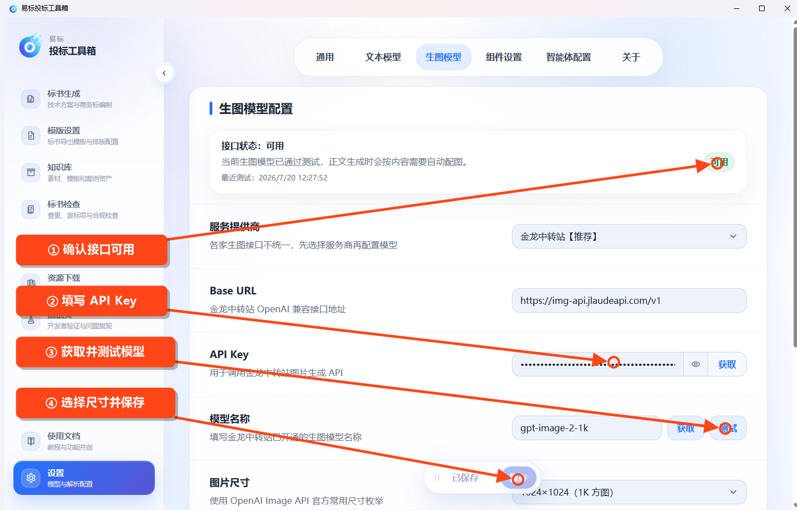

# 配置生图模型（可选）

需要让正文自动生成 AI 图片时，进入 **设置 → 生图模型**。

1. 查看顶部接口状态；显示“可用”说明最近一次测试成功。
2. 选择服务提供商，填写 Base URL、API Key 和模型名称。
3. 点击模型名称右侧的 **获取** 选择模型，也可以直接填写。
4. 选择图片尺寸，并按服务能力设置并发上限和请求类型。
5. 点击 **测试**，成功后点击底部 **保存**。

不需要 AI 图片时可以跳过此项；Mermaid 图和 HTML 配图仍可在本地生成。
